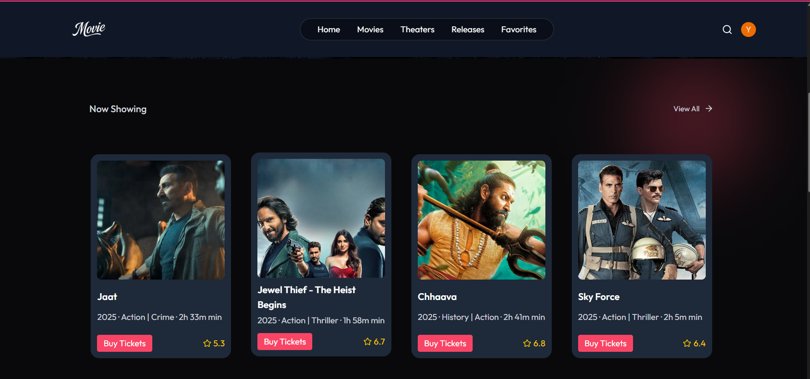
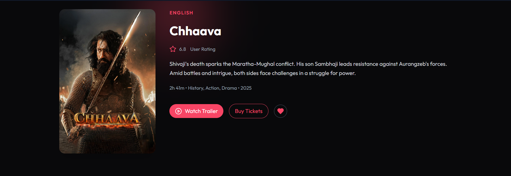
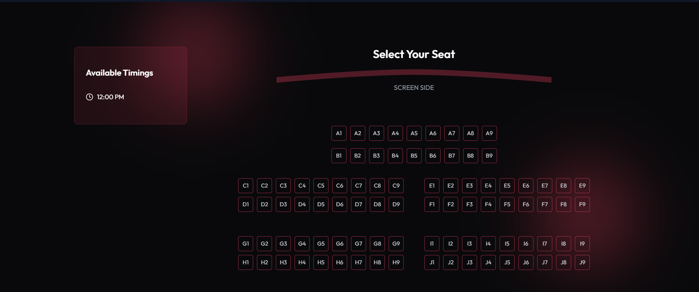

# 🎬 Movie Booking App

A full-stack Movie Booking Application where users can explore movies, select seats, check show timings, and book tickets. Admins can manage movies, showtimes, and user bookings through a separate dashboard.

---

## 🚀 Live Demo

🔗 [View Live](https://movie-booking-1-hik8.onrender.com)

---

## 📸 Screenshots

| Home Page                         | Movie Details Page                | Booking Page                      |
|----------------------------------|----------------------------------|-----------------------------------|
|  |  |  |

---

## ✨ Features

### 👥 User Side
- Signup and Login using Clerk (supports Email, Phone, and Social login).
- Multi-session support — switch between accounts without logging out.
- View all currently running movies.
- See movie details, descriptions, and show timings.
- Select **preferred seats** while booking.
- Book tickets and get instant confirmation.
- Get **email reminders** before movie time.
- View your personal bookings and history.

### 🛠️ Admin Side
- Admin authentication with protected dashboard.
- Add/edit/delete movies with posters, timings, descriptions.
- Manage movie listings and upcoming shows.
- View all user bookings.
- **Send booking confirmation & reminders via email** using background jobs.

---

## ⚙️ Advanced Features

- 🔐 **Clerk Authentication**  
  Integrated Clerk for secure and flexible authentication:
  - Supports email, phone number, and social signups.
  - Multi-session support to switch between profiles easily.

- 📧 **Inngest Integration (Background Jobs)**  
  Background task scheduling with Inngest:
  - Send email to all users when a new movie is added.
  - Send booking confirmation email instantly after booking.
  - Send movie reminder emails few hours before showtime.

---

## 🧰 Tech Stack

### 💻 Frontend
- React.js
- Tailwind CSS
- React Router
- Axios
- Clerk Authentication

### 🖥️ Backend
- Node.js
- Express.js
- MongoDB
- Mongoose
- JWT Authentication
- Multer (for image upload)
- Inngest (for background jobs)
- Nodemailer (for sending emails)

---

## 📂 Folder Structure

```bash
Movie_Booking/
├── frontend/         # React Frontend
│   ├── public/
│   └── src/
├── backend/          # Node.js + Express Backend
│   ├── models/
│   ├── routes/
│   ├── controllers/
│   └── server.js
├── screenshots/      # UI screenshots
└── README.md
```

---

## 🧰 Local Setup Instructions

### ✅ Requirements:
- Node.js installed
- MongoDB connection (local or Atlas)
- Clerk project keys
- Vite (comes with frontend)

---

### 1️⃣ Backend Setup

```bash
cd backend
npm install
```

Create a `.env` file in `/backend`:

```env
MONGO_URL=your_mongo_url
JWT_SECRET=your_jwt_secret
CLERK_SECRET_KEY=your_clerk_backend_secret
```

Start the server:

```bash
npm start
```

---

### 2️⃣ Frontend Setup

```bash
cd ../frontend
npm install
```

Create a `.env` file in `/frontend`:

```env
VITE_BACKEND_URL=http://localhost:5000
VITE_CLERK_PUBLISHABLE_KEY=your_clerk_frontend_key
```

Start the frontend:

```bash
npm run dev
```

> Frontend runs at `http://localhost:5173`

---

## 👨‍💻 Author

**Ritik Gupta**  
🎓 IET Lucknow  
📧 ritkgupta2275@gmail.com  
🔗 [LinkedIn](https://www.linkedin.com/in/ritikgupta)  
💻 [GitHub](https://github.com/RitikGupta2005)
